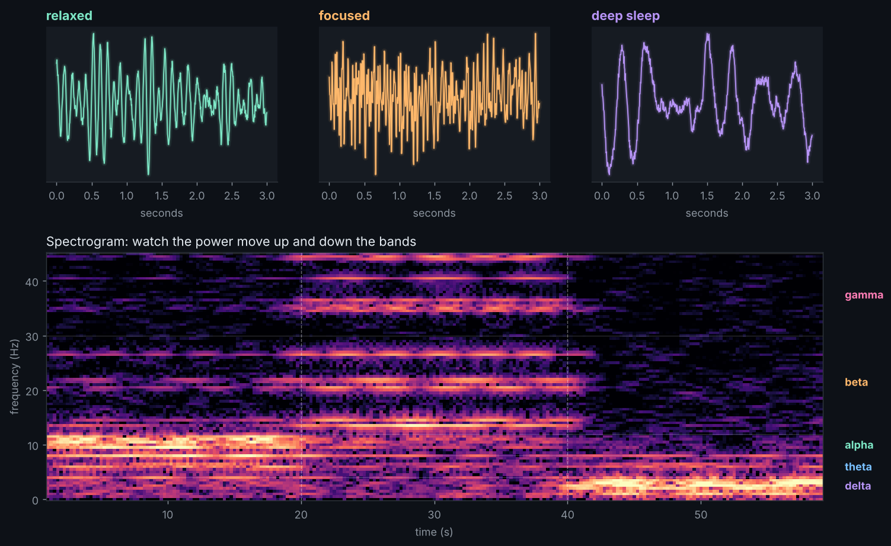

# Brainwave Radio

Synthetic EEG that drifts through three mental states over 60 seconds: relaxed, focused, and deep sleep. The spectrogram shows power sliding between the classic brainwave bands.

## Run it

    pip install numpy scipy matplotlib
    python radio.py

## Play with it

Edit the `BANDS` table in `radio.py` to change how much of each band shows up in each state, or add a fourth state (try meditation: lots of alpha and theta).

## Neuroscience notes

| Band | Frequency | Classic association |
|------|-----------|---------------------|
| Delta | 1-4 Hz | deep sleep |
| Theta | 4-8 Hz | drowsiness, memory |
| Alpha | 8-12 Hz | relaxed, eyes closed |
| Beta | 13-30 Hz | active thinking |
| Gamma | 30+ Hz | focused processing |

The background is 1/f ("pink") noise, which real EEG also shows. The data here is simulated, not recorded from a person.
